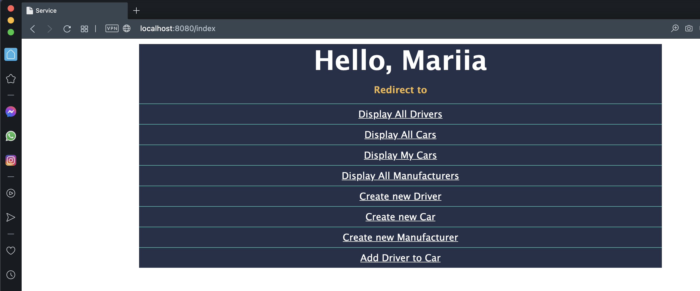

### Table of contents
~~~~
1.About The Project
2.Built With
3.Getting Started
4.Project Improvement
~~~~

#### 1.About The Project
This project is about work of taxi service. You can register or login as driver.
Driver behaves as User. Also you can add to database new manufacturer, new car, new driver, 
add driver to car. One car can have several drivers. 
In main menu you also find such actions: display all manufacturers and cars, display your cars, 
display all drivers. Only authenticated users can do requests because of Filter.

From the technical point of view it is 3-tier architecture WEB-project with Database connection.
~~~~
- Controller-layer: processing requests from the user and generating a response
- Service-layer: business logic of taxi service work, authentication
- DAO-layer: realization of CRUD-methods, custom methods
~~~~

To Register pass name, license number, login and password.
Then to login.
Use WEB-app freely.
You can see all possible actions on the [index page]

#### 2.Built With
~~~~
- Maven
- MySQL
- Tomcat
~~~~
Technologies used: 
~~~~
- JDBC
- WEB 
- Servlets
- Filter
- Logger
- HTML/CSS  
- Dependency Injection
- S.O.L.I.D
- OOP principles 
~~~~

#### 3.Getting Started
### Installation
~~~~
1. Clone the repo
2. Open scr/main/java/jdbc/util/ConnectionUtil and enter all necessary data
3. Run script from the resources/init_db.sql file in the MySQLWorkbench.
4. Build project use command: mvn compile
5. Run Tomcat configuration
~~~~

#### 4.Project Improvement
1. One of the ways to improve this project is create test classes and unit tests for 
   checking the work of each service to cover code lines at least on 80%. 

   
[index page]: http://localhost:8080/index
